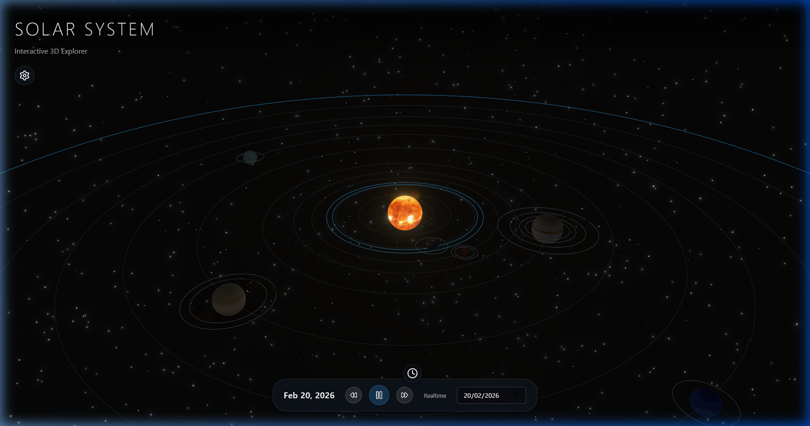

# 3D Solar System

A React-based 3D Solar System application. The application displays a realistic 3D representation of the solar system, allowing users to zoom in and out, and hover over celestial bodies to view detailed information. The primary goal is to achieve a visually immersive and interactive educational experience.



## Features

- **Interactive 3D View:** Built using `@react-three/fiber` and `@react-three/drei`. Allows panning, zooming, and rotating across the solar system space.
- **Detailed Celestial Bodies:** Includes the Sun and major planets with distinctive visuals, textures, and realistic orbital paths.
- **Asteroid Belt:** Features an animated, procedurally generated asteroid belt with instances calculated for optimal performant rendering.
- **Spacecrafts:** Visualize iconic spacecrafts such as the ISS, JWST, and Voyager with simulated orbital paths and custom geometries.
- **Simulation Controls:** Play, pause, or fast-forward time to watch orbits in action. Toggle options such as "Realistic Scale" for precise orbital distances or "Show Orbits" to visualize planetary trails.
- **Lighting & Post-Processing Effects:** Includes a glowing sun effect (Bloom), ambient space lighting, and a starry background for a cinematic feel.
- **Performant State Management:** Powered by Zustand to seamlessly manage simulation time (`timeSpeed`, `simulationDate`), focus states (`focusedPlanetId`), and UI controls.

## Getting Started

First, install dependencies:

```bash
npm install
```

Start the development server:

```bash
npm run dev
```

Build for production:

```bash
npm run build
```

## Technologies Used
- React (v19)
- Three.js
- React Three Fiber
- React Three Drei
- React Three Postprocessing
- Zustand
- Vite

## Changelog

### [Unreleased]

#### Added
- Asteroid Belt component with procedurally generated asteroids and instanced meshes for performance.
- Spacecraft component featuring the ISS, James Webb Space Telescope (JWST), and Voyager.
- Zustand global state for time acceleration (`timeSpeed`), play/pause (`isPlaying`), and simulation dates (`simulationDate`).
- Dynamic orbit toggling (`showOrbits`) and realistic vs. visual scales (`realisticScale`).
- 3D Interactive Solar System built with `@react-three/fiber` and `@react-three/drei`.
- Information cards detailing facts about each celestial body.
- Detailed textures for planets and an emissive bloom effect for the Sun.
- Orbital controls for user interaction (pan, zoom, orbit).
